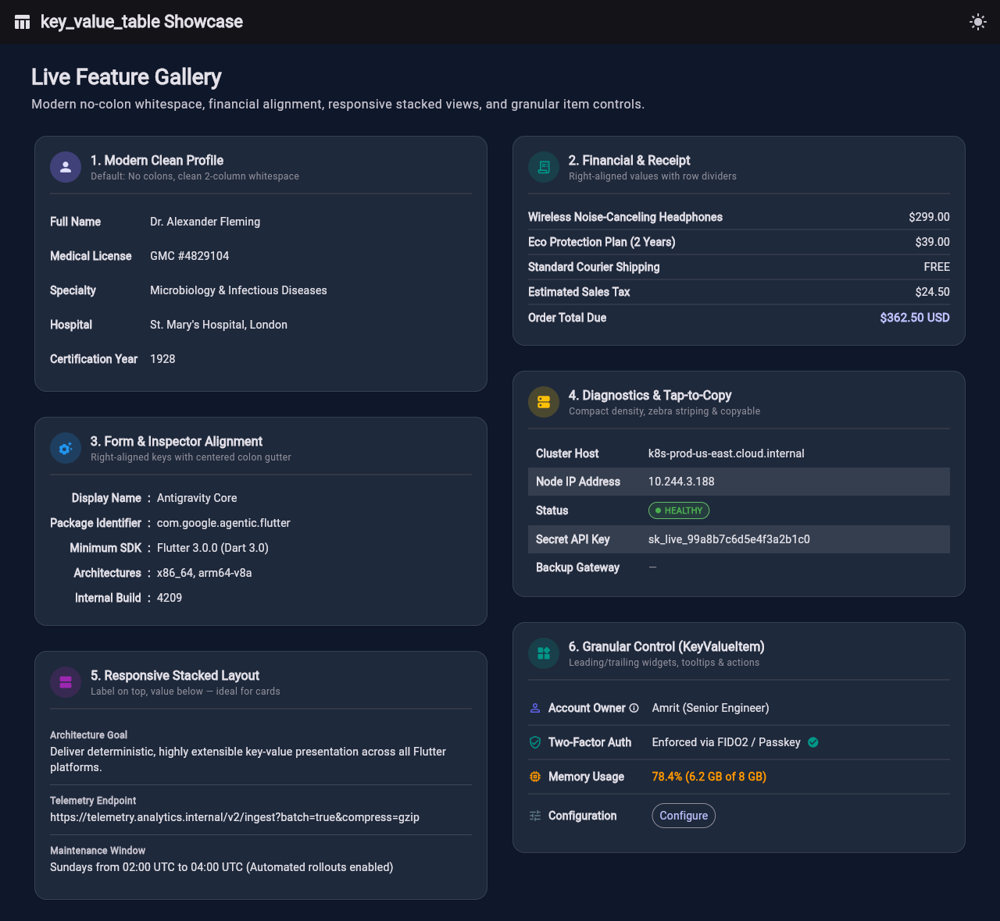
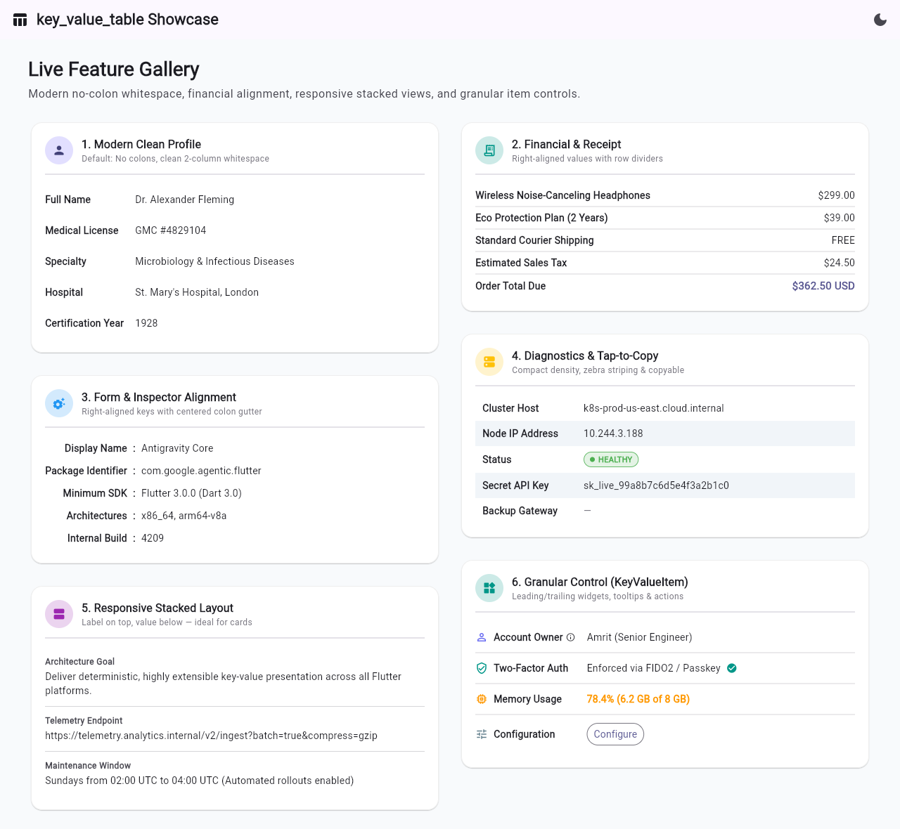
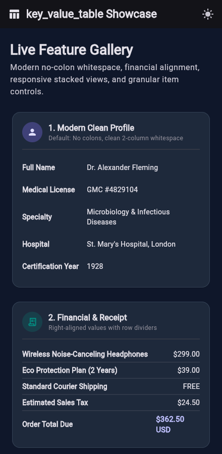
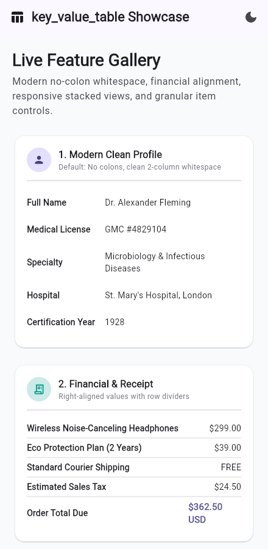

# key_value_table_demo

A live showcase and screenshot companion app for the [`key_value_table`](https://pub.dev/packages/key_value_table) Flutter package.

---

### Desktop & Web Showcase

<p align="center">
  
</p>

<p align="center">
  
</p>

### Mobile Responsive Showcase

<p align="center">
  
  &nbsp;&nbsp;&nbsp;&nbsp;
  
</p>

---

## Features

- **Light & Dark Theme Toggle:** Easily toggle between light and dark Material 3 themes directly from the AppBar (or launch with `?theme=dark` / `?theme=light`).
- **Adaptive Responsive Layout:**
  - **Wide screens (> 860px):** 2-column side-by-side grid showcasing all cards simultaneously.
  - **Mobile screens (≤ 860px):** Clean single-column scrollable feed.
- **Showcase Cards:**
  1. **Modern Clean Profile:** Default whitespace-separated 2-column layout without colons.
  2. **Financial & E-Commerce Receipt:** Right-aligned numeric/currency values with horizontal row dividers.
  3. **Form & Inspector Alignment:** Right-aligned keys with centered colon gutters and left-aligned values.
  4. **Server Diagnostics:** Compact density, zebra striping (`alternateRowColor`), one-tap clipboard copy (`copyable: true`), status badges, and null placeholders.
  5. **Responsive Stacked Layout:** Label on top, value below — ideal for cards, mobile screens, and multiline values.
  6. **Granular Control (`KeyValueItem`):** Leading icons, trailing verified badges, tooltips, custom styles, and action buttons.

---

## Getting Started

### Prerequisites

Ensure Flutter is installed and set up on your machine:

```bash
flutter --version
```

### Install Dependencies

```bash
flutter pub get
```

### Run Across Platforms

```bash
# Web
flutter run -d chrome

# Desktop (Linux / macOS / Windows)
flutter run -d linux

# Mobile (Android / iOS)
flutter run -d <device-id>
```

### Run Tests

```bash
flutter test
```
